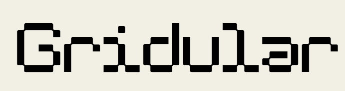
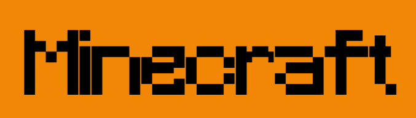
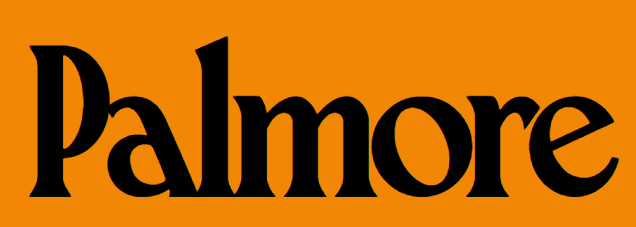
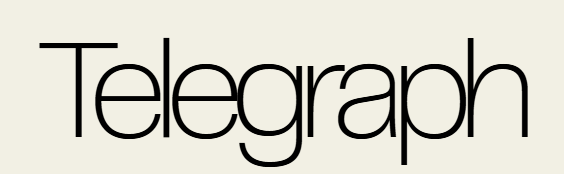

# ⚛️ React + Vite Starters


# This project is under construction. So, the link might not work. Please stay tuned.

A collection of 🔥 React templates powered by Vite — built to give you a head start on modern frontend projects. Just clone, code, and flex! 💅

> More templates dropping soon. Stay tuned. 📡

---

## 🌈 Available Templates

### 📦 Brand Template
Modern brand-focused design with premium components.

**The below links are safe. You can download it without any issues**

**If the link below doesn't work, you can download the specific folder manually by following the instructions given below the feature section**

---

## 🎨 Font Collection

| Font | Screenshot | Download |
|------|------------|----------|
| Apple Garamond | [](https://github.com/Ansh-dhanani/react_template/tree/main/fonts/apple-garamond) | [Download](https://download-directory.github.io/?url=https://github.com/Ansh-dhanani/react_template/tree/main/fonts/apple-garamond) |
| Default Lingo | [](https://github.com/Ansh-dhanani/react_template/tree/main/fonts/default-lingo) | [Download](https://download-directory.github.io/?url=https://github.com/Ansh-dhanani/react_template/tree/main/fonts/default-lingo) |
| Gridular | [](https://github.com/Ansh-dhanani/react_template/tree/main/fonts/gridular) | [Download](https://download-directory.github.io/?url=https://github.com/Ansh-dhanani/react_template/tree/main/fonts/gridular) |
| MeraPro | [](https://github.com/Ansh-dhanani/react_template/tree/main/fonts/merapro) | [Download](https://download-directory.github.io/?url=https://github.com/Ansh-dhanani/react_template/tree/main/fonts/merapro) |
| Minecraft | [](https://github.com/Ansh-dhanani/react_template/tree/main/fonts/minecraft) | [Download](https://download-directory.github.io/?url=https://github.com/Ansh-dhanani/react_template/tree/main/fonts/minecraft) |
| Montblanc | [](https://github.com/Ansh-dhanani/react_template/tree/main/fonts/montblanc) | [Download](https://download-directory.github.io/?url=https://github.com/Ansh-dhanani/react_template/tree/main/fonts/montblanc) |
| Palmore | [](https://github.com/Ansh-dhanani/react_template/tree/main/fonts/palmore) | [Download](https://download-directory.github.io/?url=https://github.com/Ansh-dhanani/react_template/tree/main/fonts/palmore) |
| Tan Kulture | [](https://github.com/Ansh-dhanani/react_template/tree/main/fonts/tan-kulture) | [Download](https://download-directory.github.io/?url=https://github.com/Ansh-dhanani/react_template/tree/main/fonts/tan-kulture) |
| Telegraph | [](https://github.com/Ansh-dhanani/react_template/tree/main/fonts/telegraph) | [Download](https://download-directory.github.io/?url=https://github.com/Ansh-dhanani/react_template/tree/main/fonts/telegraph) |

---


- **Direct Download**: [📥 ZIP](https://download-directory.github.io/?url=https://github.com/Ansh-dhanani/react_template/tree/main/Templates/brand_template1)
- **Folder**: Templates/brand_template1
- **Perfect for**: Brand websites, corporate sites

#### 🔍 Components (Brand Template)
| Component | Screenshot | Font Screenshot | Videos | Description | Download |
|----------|------------|----------------|--------|-------------|----------|
| Navmenu.jsx |  |  | <video width="200" controls><source src=".public/Navmenu1.mp4" type="video/mp4">Video</video> | Premium navigation menu | [Download](https://raw.githubusercontent.com/Ansh-dhanani/react_template/main/Templates/brand_template1/components/Navmenu.jsx) |
| CustomCursor.jsx |  |  | <video width="200" controls><source src="./public/CustomCursor1.mp4" type="video/mp4">Video</video> | Interactive custom cursor | [Download](https://raw.githubusercontent.com/Ansh-dhanani/react_template/main/Templates/brand_template1/components/CustomCursor.jsx) |

### 🌐 Landing Page Starter
Fully responsive hero layout with sections.


- **Direct Download**: [📥 ZIP](https://download-directory.github.io/?url=https://github.com/Ansh-dhanani/react_template/tree/main/Templates/Template_2)
- **Folder**: Templates/Template_2
- **Perfect for**: Portfolios, product pages

#### 🔍 Components (Landing Page)
| Component | Screenshot | Font Screenshot | Videos | Description | Download |
|----------|------------|----------------|--------|-------------|----------|
| Hero.jsx |  |  | [Video](./videos/landing/hero.mp4) | Eye-catching hero section | [Download](https://raw.githubusercontent.com/Ansh-dhanani/react_template/main/Templates/Template_2/components/Hero.jsx) |
| Features.jsx |  |  | [Video](./videos/landing/features.mp4) | Responsive features section | [Download](https://raw.githubusercontent.com/Ansh-dhanani/react_template/main/Templates/Template_2/components/Features.jsx) |

### 📊 Dashboard Starter
A clean, modern admin dashboard layout.


- **Direct Download**: [📥 ZIP](https://download-directory.github.io/?url=https://github.com/Ansh-dhanani/react_template/tree/main/Templates/Template_3)
- **Folder**: Templates/Template_3
- **Perfect for**: SaaS apps, admin panels

#### 🔍 Components (Dashboard)
| Component | Screenshot | Font Screenshot | Videos | Description | Download |
|----------|------------|----------------|--------|-------------|----------|
| Sidebar.jsx |  |  | [Video](./videos/dashboard/sidebar.mp4) | Modern sidebar for navigation | [Download](https://raw.githubusercontent.com/Ansh-dhanani/react_template/main/Templates/Template_3/components/Sidebar.jsx) |
| StatsCard.jsx |  |  | [Video](./videos/dashboard/statscard.mp4) | Card for displaying metrics | [Download](https://raw.githubusercontent.com/Ansh-dhanani/react_template/main/Templates/Template_3/components/StatsCard.jsx) |

---

## 🛠️ Features (All Templates)

- 🧠 Built with **React 18 + Vite**
- 🎨 TailwindCSS pre-configured
- 📁 Clean project structure
- 🧩 Components organized for scale
- ⚡ Super fast dev environment
- ✅ ESLint & Prettier included

---

## 🚀 Getting Started

```bash
# Clone the repo
npx degit Ansh-dhanani/react_template my-app

# OR clone only one template manually:
# (recommended for advanced users)
git clone --no-checkout https://github.com/Ansh-dhanani/react_template.git
cd react_template
git sparse-checkout init --cone
git sparse-checkout set Templates/brand_template1

# Install deps
cd Templates/brand_template1
npm install

# Start dev server
npm run dev
```

---

## 🧠 Ideas for Upcoming Templates

- 💼 Portfolio w/ animation
- 🧠 AI SaaS UI
- 📦 E-commerce starter
- 🎮 Game UI
- 🎙️ Podcast layout

> Got an idea? [Open an issue](https://github.com/Ansh-dhanani/react_template/issues) or submit a PR! 🔥

---

## ✨ Credits

Made with 💙 by [Ansh Dhanani](https://github.com/Ansh-dhanani)

---

## 🧃 React Template Box

```txt
📁 Templates/
├── brand_template1/  → Brand Template
├── Template_2/  → Landing Page
├── Template_3/  → Dashboard
└── More coming soon...
```

> React templates curated for modern devs. Clone. Customize. Create. 💫
